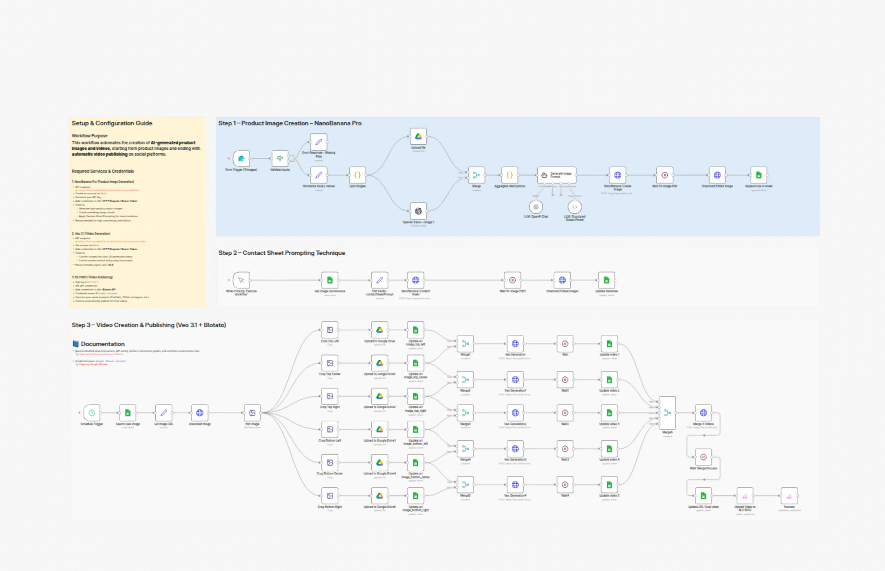

# Create AI product images and marketing videos with NanoBanana Pro, Veo 3.1 and Blotato

Advanced n8n automation for Create AI product images and marketing videos with NanoBanana Pro, Veo 3.1 and Blotato.

## Overview
- Category: 
- Complexity: advanced
- Source: n8n workflow template export

## What This Automation Does
Automate product images and short marketing videos with NanoBanana Pro + Veo 3.1, then auto-publish via Blotato. Faster, consistent visuals.

## Included Files
- `workflow.json`

## Setup
1. Import `workflow.json` into n8n.
2. Configure required credentials for the services used in the workflow nodes.
3. Update any environment variables or static values inside nodes (API keys, URLs, IDs).
4. Run a test execution and then activate the workflow.

## Tech Stack

- `@blotato/n8n-nodes-blotato.blotato`
- `@n8n/n8n-nodes-langchain.agent`
- `@n8n/n8n-nodes-langchain.lmChatOpenAi`
- `@n8n/n8n-nodes-langchain.openAi`
- `@n8n/n8n-nodes-langchain.outputParserStructured`
- `n8n-nodes-base.code`
- `n8n-nodes-base.editImage`
- `n8n-nodes-base.formTrigger`
- `n8n-nodes-base.googleDrive`
- `n8n-nodes-base.googleSheets`
- `n8n-nodes-base.httpRequest`
- `n8n-nodes-base.if`
- `n8n-nodes-base.manualTrigger`
- `n8n-nodes-base.merge`
- `n8n-nodes-base.scheduleTrigger`
- `n8n-nodes-base.set`
- `n8n-nodes-base.stickyNote`
- `n8n-nodes-base.wait`

## Author

Murtaza Baig

## Screenshots

## License
MIT License. See `LICENSE`.